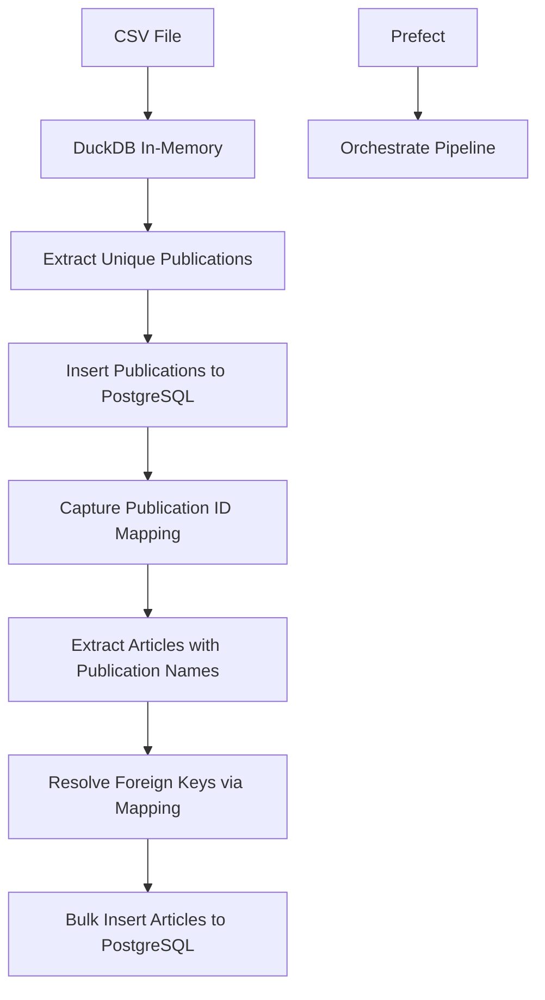

# DuckDB + Prefect Data Pipeline

A modern data pipeline that demonstrates how to efficiently process CSV data using **DuckDB** for analytical queries and **PostgreSQL** for persistent storage, with **Prefect** for workflow orchestration.

## 🎯 Project Overview

This project solves a common data engineering challenge: **processing large CSV files with complex foreign key relationships** between tables that can't be easily resolved across different database systems.

### The Challenge We're Solving

When working with CSV data containing articles and publications, we face several technical challenges:

1. **Cross-Database Limitations**: DuckDB and PostgreSQL can't directly share data or foreign keys
2. **Foreign Key Resolution**: Articles reference publications by name, but PostgreSQL needs UUID foreign keys
3. **Performance**: Need to process large datasets efficiently with bulk operations
4. **Data Validation**: Ensure data integrity during the ETL process

### Our Solution Architecture



## 🏗️ Architecture & Design Decisions

### Why DuckDB?
- **Lightning Fast CSV Processing**: DuckDB excels at analytical queries on CSV data
- **Memory Efficiency**: Processes large files without loading everything into memory
- **SQL Interface**: Familiar SQL syntax for data extraction and transformation
- **Zero Configuration**: No server setup required

### Why PostgreSQL for Storage?
- **ACID Compliance**: Guaranteed data consistency and integrity
- **Advanced Features**: JSON support, full-text search, advanced indexing
- **Scalability**: Handles concurrent access and large datasets
- **Mature Ecosystem**: Rich tooling and extension support

### Why SQLAlchemy Async?
- **Performance**: Non-blocking I/O for better throughput
- **Modern Python**: Leverages Python's asyncio capabilities
- **Type Safety**: Full typing support with modern Python features
- **Bulk Operations**: Efficient bulk inserts with `execute_values` patterns

### Why msgspec for Validation?
- **Performance**: 10-40x faster than Pydantic for serialization/deserialization
- **Memory Efficient**: Lower memory footprint than alternatives
- **Type Safety**: Struct-based validation with excellent IDE support
- **Simple**: Minimal boilerplate compared to other validation libraries

## 📁 Project Structure

```
duckdb_prefect_data_pipeline/
├── src/pipeline/
│   ├── configs/                    # Configuration management
│   │   ├── __init__.py
│   │   └── configurations.py       # msgspec-based config with env loading
│   ├── models/                     # SQLAlchemy ORM models
│   │   ├── __init__.py
│   │   ├── articles.py            # Article model with foreign key
│   │   └── publication.py         # Publication model with UUID primary key
│   ├── transform/                  # Data transformation logic
│   │   ├── main.py                # Core ETL functions
│   │   └── validator/              # Data validation
│   │       ├── articles.py        # msgspec validators for articles
│   │       └── publications.py    # msgspec validators for publications
│   ├── orchestrate/               # Workflow orchestration (future)
│   │   └── prefect.py            # Prefect flows and tasks
│   └── db.py                     # Database connection and session management
├── migrations/                    # Alembic database migrations
│   └── versions/
│       └── 7a389eb5c967_.py      # Initial schema: publications + articles tables
├── pyproject.toml                # Modern Python dependency management
├── alembic.ini                   # Database migration configuration
└── README.md                     # This file
```

## 🚀 Getting Started

### Prerequisites

- **Python 3.11+** (for modern async/typing features)
- **PostgreSQL 12+** (with UUID extension support)
- **uv** (recommended) or pip for dependency management

### 1. Clone and Setup Environment

```bash
git clone <your-repo-url>
cd duckdb_prefect_data_pipeline

# Using uv (recommended - much faster)
uv venv
source .venv/bin/activate  # On Windows: .venv\Scripts\activate
uv pip install -e .

# Or using pip
pip install -e .
```

### 2. Database Setup

```bash
# Create PostgreSQL database
createdb your_database_name

# Create environment file
cp .env.example .env
```

### 3. Configure Environment Variables
Create a `.env` file in the project root with your database credentials:
```env
# Database Configuration
DB_NAME=your_database_name
DB_USER=your_username
DB_PASSWORD=your_password
DB_HOST=localhost
DB_PORT=5432

# Application Environment
ENVIRONMENT=development
```

### 4. Run Database Migrations

```bash
# Initialize Alembic (if needed)
alembic upgrade head
```

### 5. Run the Pipeline

```python
import asyncio
from src.pipeline.transform.main import run_optimized_pipeline

# Run the complete pipeline
stats = asyncio.run(run_optimized_pipeline())
print(f"Processed {stats['publications_processed']} publications")
print(f"Inserted {stats['articles_inserted']} articles")
```


## 📚 Learning Resources

If you're building a similar project, these resources will help:

### DuckDB Resources
- [DuckDB Documentation](https://duckdb.org/docs/)
- [DuckDB Python API](https://duckdb.org/docs/api/python/overview)
- [DuckDB Performance Guide](https://duckdb.org/docs/guides/performance/overview)

### SQLAlchemy Async
- [SQLAlchemy Async Tutorial](https://docs.sqlalchemy.org/en/20/orm/extensions/asyncio.html)
- [AsyncPG Documentation](https://magicstack.github.io/asyncpg/current/)

### msgspec
- [msgspec Documentation](https://jcristharif.com/msgspec/)
- [Performance Comparison](https://jcristharif.com/msgspec/benchmarks.html)

### Prefect
- [Prefect Documentation](https://docs.prefect.io/)
- [Prefect Best Practices](https://docs.prefect.io/2.10.1/concepts/best-practices/)
